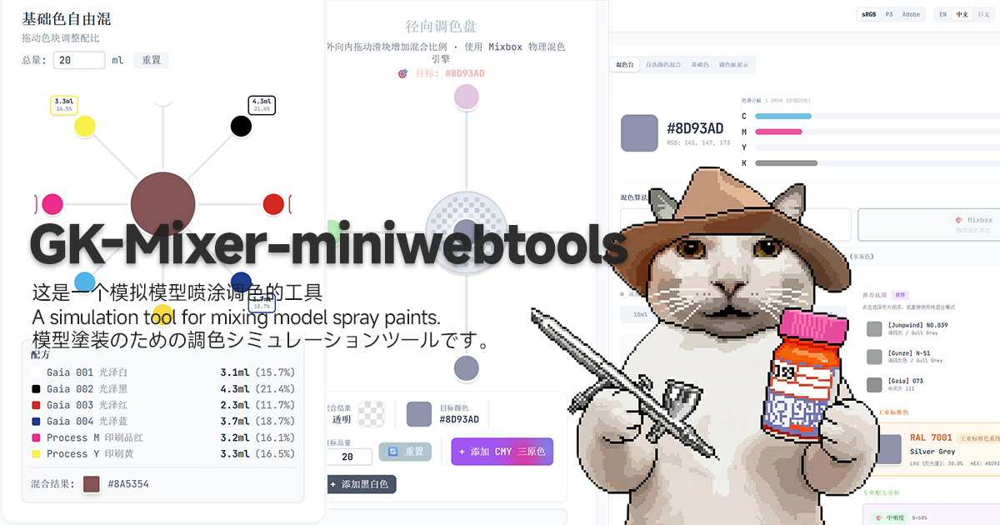

# GK Paint Mixing Simulator (GK_混色模拟器)

> A futuristic, programmer-style color mixing tool for model kit painters.
> 专为 GK 模玩爱好者设计的赛博风格调漆模拟器。
> 模型塗装のための調色シミュレーションツールです。



🔗 **Live Demo**: [gk-colormixer.com.hdinever.top](https://gk-colormixer.com.hdinever.top/)


## 🎨 Project Overview

**GK Mixer** allows modelers to extract colors from reference images and simulate paint mixing using real-world physics. It bridges the gap between digital RGB colors and physical pigment mixing (FDM/Resin/Paints).

Designed with a clean, low-saturation "Macaron" aesthetic for high readability, with comprehensive mobile optimization and professional color space support.

## ✨ Key Features

### 1. Visual Input & Analysis (源图像输入)
* **Smart Extraction**: Drag & drop images to auto-detect up to 8 prominent colors.
* **Precision Tools**: Zoom/Pan loupe with manual eyedropper for precise color picking.
* **Color Space Support**: 🆕 Native support for **sRGB, Display P3, and Adobe RGB (1998)** color spaces.
* **Gamut Validation**: Automatic out-of-gamut detection with visual indicators.
* **Color Decomposition**: Breaks down colors into standard RGB & CMYK percentages with real-time conversion.

### 2. Paint Mixing Console (混色控制台)
* **Physical Simulation**: Uses **Kubelka-Munk theory** (via Mixbox) for realistic pigment mixing (Blue + Yellow = Green), distinct from standard digital blending.
* **Brand Matching**: Auto-matches colors to **Mr. Hobby, Gaia, Jumpwind, and Gunze** paint databases with ΔE color distance calculation.
* **CMY Mode**: Uses only Cyan, Magenta, Yellow primaries (no K/black) for authentic subtractive color mixing.
* **Dual Modes**:
    * **CMYK Correction**: Standard subtractive mixing for color matching.
    * **Universal Blend**: Base Paint + Additive X (CMY or other brands).

### 3. Interactive Mixing Modes 🆕

#### 3.1 Radial Palette Mixer (径向自选混合)
* **Interactive Canvas**: Drag-and-drop sliders arranged radially around a central mixing circle.
* **Real-time Blending**: Uses Mixbox latent space for physical paint mixing simulation.
* **Volume Calculator**: Automatically calculates ml needed for each color based on target volume (10-60ml presets).
* **Visual Feedback**: 
  - Radial slider positioning (outer=0%, inner=100%)
  - Mosaic pattern when no colors mixed
  - Target color comparison ring
  - Animated transitions with anime.js
* **Smooth Dragging**: Elastic animations and glow effects during interaction.
* **Color Selection**: Choose from extracted palette or use any available colors.

#### 3.2 Basic Color Mixer (基础色混合) 🆕
* **Foundation Palette**: Pre-loaded with 5 Gaia base colors (White, Black, Red, Blue, Yellow).
* **Physical Mixing Engine**: Powered by Mixbox for realistic subtractive color blending.
* **Interactive Sliders**: Drag radial sliders to adjust each color's contribution (0-100%).
* **Real-time Preview**: Central mixing circle updates instantly with resulting color.
* **Volume Calculation**: Precise ml breakdown for each component based on target volume.
* **Responsive Design**: Fluid layout adapts from mobile (240px minimum) to desktop (500px base).
* **Performance Optimized**: Throttled rendering for smooth 60fps animation on all devices.

### 4. Palette Visualizer (色板生成器) 🆕
* **Export Modes**: 
  - **STRIPES**: Horizontal color band layout
  - **CLAY**: Organic stone/clay texture overlay
  - **COMIC**: Comic-style speech bubble design
  - **TICKET**: Circular "Infinity Stones" themed arrangement
* **High-Quality Export**: One-click export to PNG with 2x resolution scaling via html2canvas.
* **Source Image Integration**: Optionally include reference image in visualizations.
* **Dynamic Layout**: Automatically adapts to extracted color count (1-8 colors).

### 5. Virtual Paint Bottle (调漆瓶模拟器)
* **Visual Feedback**: Real-time liquid simulation showing the mixed color inside a calibrated bottle.
* **Volume Presets**: One-click scaling for 10ml, 20ml, 30ml, 40ml, 50ml, 60ml batches.
* **Dynamic Recipe**: Instantly calculates exactly how many mL of target paint to add to the base.
* **Fluid Animations**: Powered by `anime.js` for smooth liquid transitions.
* **CMYK Layer Visualization**: Stacked liquid layers representing each CMYK component.

### 6. Brightness Algorithm (明度调配算法)
* **Custom Algorithm**: Self-developed brightness-based color mixing calculation.
* **Primer Recommendation**: Intelligent primer selection (white/gray/black) based on target color luminance.
* **Accurate Ratios**: Precise percentage calculations for achieving target brightness levels.
* **No External API**: Fully offline, instant response without network dependency.

### 7. Advanced UX/UI
* **Theming**: Seamless Dark/Light mode toggle with system preference detection.
* **i18n**: Full support for English, Chinese (中文), and Japanese (日文).
* **Responsive Layout**: Fluid grid system adapts from mobile (320px) to desktop (1920px+).
* **Mobile Optimization**: 🆕 Touch-optimized interactions, pinch-to-zoom, and responsive canvas rendering.
* **Performance**: Throttled event handlers, RAF-based animations, and lazy color extraction for smooth 60fps experience.

## 🛠 Tech Stack

* **Frontend**: React 19, TypeScript, Vite
* **Styling**: Tailwind CSS with custom Macaron color palette
* **Animation**: Anime.js for fluid UI transitions
* **Canvas**: HTML5 Canvas API with color space support
* **Algorithm**: Mixbox (Physics-based Kubelka-Munk pigment mixing) + Custom Brightness Algorithm
* **Export**: html2canvas for high-resolution palette exports
* **Deployment**: Cloudflare Pages with serverless functions

## 📊 Technical Highlights

### Color Space Implementation
* **RGB ↔ XYZ ↔ Linear RGB** conversions with proper gamma correction
* **sRGB, Display P3, Adobe RGB** transformation matrices (D65 white point)
* **Gamut mapping** with visual indicators for out-of-gamut colors
* **Canvas color space rendering** for accurate color display

### Performance Optimizations 🆕
* **Responsive Canvas Sizing**: Dynamic scaling based on container width (240px-500px)
* **Event Throttling**: Touch/mouse events limited to 16ms intervals (60fps)
* **RAF-based Animations**: RequestAnimationFrame for smooth rendering
* **Lazy Color Extraction**: Debounced palette generation to prevent UI blocking
* **Memory Management**: Proper cleanup of event listeners and animation frames

### Mobile-First Design 🆕
* **Touch Interactions**: Native touch event handling with gesture support
* **Fluid Typography**: Responsive font sizing (10px-16px range)
* **Flexible Layouts**: CSS Grid/Flexbox with breakpoint-aware spacing
* **High-DPI Support**: Retina display optimization with proper pixel ratio handling

## ⚡ Quick Start

```bash
# Install dependencies
npm install

# Start development server
npm run dev

# Build for production
npm run build

# Preview production build locally
npm run preview
```


## � Git Workflow

### Quick Push (推送更新)
```bash
# Stage all changes
git add .

# Commit with message
git commit -m "feat: your feature description"

# Push to remote
git push origin main
```

### Commit Message Convention
| Prefix | Usage |
|--------|-------|
| `feat:` | New feature |
| `fix:` | Bug fix |
| `docs:` | Documentation update |
| `style:` | UI/CSS changes |
| `perf:` | Performance optimization |
| `refactor:` | Code refactoring |

### After Push
- Cloudflare Pages auto-deploys on push to `main`
- Wait ~1-2 minutes for build completion
- Verify at: https://gk-colormixer.com.hdinever.top/

## �📱 Browser Compatibility

* **Desktop**: Chrome 94+, Firefox 94+, Safari 15+, Edge 94+
* **Mobile**: iOS Safari 15+, Chrome for Android 94+
* **Color Spaces**: Display P3 (Safari/iOS), sRGB (universal), Adobe RGB (calculated fallback)

## 🚀 Deployment

### Cloudflare Pages
Detailed deployment guide: [CLOUDFLARE_DOCS.md](./CLOUDFLARE_DOCS.md)

**Quick Deploy:**
1. Connect Git repository to Cloudflare Dashboard
2. Build command: `npm run build`
3. Build output: `dist`
4. Access: `https://your-project.pages.dev`

📖 More deployment info: [docs/deployment/](./docs/deployment/)

## �️ Social Media Preview (OG Image)

Open Graph meta tags enable rich link previews on Telegram, Discord, Twitter, Facebook, etc.

### Configuration
Located in `index.html`:
```html
<meta property="og:image" content="https://gk-colormixer.com.hdinever.top/og-image.png" />
<meta property="og:title" content="GK Paint Mixer - 模型喷涂调色模拟器" />
<meta property="og:description" content="模型喷涂调色模拟工具..." />
```

### Image Specifications
| Property | Value |
|----------|-------|
| Location | `public/og-image.png` |
| Size | 1200 × 630 px |
| Format | PNG |
| Max Size | < 5MB |

### Refresh Telegram Preview Cache
If preview doesn't update after deployment:
1. Search `@WebpageBot` in Telegram
2. Send your URL to force re-fetch

### Validation Tools
- [opengraph.xyz](https://www.opengraph.xyz/) - Preview checker
- [Facebook Debugger](https://developers.facebook.com/tools/debug/) - Meta debugger
- [Twitter Card Validator](https://cards-dev.twitter.com/validator)

## �📚 Documentation

* [Color Space Support](./docs/COLOR_SPACE_SUPPORT.md) - Technical details on sRGB/P3/Adobe RGB implementation
* [Mobile Optimization](./docs/MOBILE_OPTIMIZATION.md) - Performance improvements and responsive design
* [Radial Mixer Details](./docs/RADIAL_MIXER_OPTIMIZATION.md) - Interactive mixing canvas architecture
* [Color Calibration](./docs/COLOR_CALIBRATION.md) - Gamut mapping and color accuracy
* [Mobile Testing Guide](./docs/MOBILE_TEST_GUIDE.md) - Cross-device testing procedures

## 🔬 Architecture Notes

### Utils Module Overview (工具模块概览)

| 模块 | 功能 | 核心函数 |
|------|------|---------|
| **colorUtils.ts** | 色彩转换 & 混色算法 | `rgbToHsb`, `rgbToLab`, `hexToRgb`, `rgbToCmyk` |
| | 图片取色 | `extractProminentColors` (量化+采样) |
| | 物理混色 | `mixboxBlend`, `mixboxMultiBlend` (Kubelka-Munk) |
| | 明度配方算法 | `calculateMixboxRatios`, `analyzeBrightnessStrategy` |
| | 品牌漆数据库 | `GAIA_PAINTS`, `JUMPWIND_PAINTS`, `GUNZE_PAINTS` |
| | 品牌漆匹配 | `findNearestPaints` (欧氏距离) |
| | RAL 工业色 | `findNearestRAL`, `hexToRAL`, `colorDataToRAL` |
| **mixbox.ts** | Mixbox 物理混色引擎 | `lerp`, `rgbToLatent`, `latentToRgb` |
| | 潜空间混合 | 7维 latent space 实现真实颜料混合 |
| **colorSpaceConverter.ts** | 色彩空间转换 | `convertToWorkingSpace`, `convertFromWorkingSpace` |
| | 色域检测 | `isInGamut` (sRGB/P3/Adobe RGB) |
| | Gamma 校正 | sRGB/Adobe RGB/P3 gamma 曲线 |
| **translations.ts** | 多语言支持 | 中文/English/日本語 UI 文本 |

### Key Algorithms (核心算法)

**1. 明度配方算法 (`analyzeBrightnessStrategy`)**
- 基于 HSB 明度 (B) 判断底漆选择
- 高明度 (>70%): 白色底漆 + 少量色相
- 中明度 (30-70%): 灰色底漆 + 色相调整
- 低明度 (<30%): 黑色底漆 + 提亮色相
- 输出: 调色步骤 + 各色百分比

**2. Mixbox 物理混色 (`mixboxBlend`)**
- Kubelka-Munk 颜料理论
- 蓝 + 黄 = 绿 (非灰色)
- 7维潜空间 (latent space) 混合

**3. 图片取色 (`extractProminentColors`)**
- 图片缩放至 300px (性能优化)
- 量化表 (QUANT_TABLE) 快速采样
- 跳跃采样 (SAMPLE_STRIDE=40)
- HSB 排序返回主色

### Component Structure
```
App.tsx                      # Main orchestrator, state management
├── DropZone                # Image upload & drag-drop
├── ColorPalette            # Extracted color grid with manual picker
├── MixerResult             # CMYK analysis + brightness algorithm + bottle simulator
├── RadialPaletteMixer      # Interactive radial canvas mixer
├── BasicColorMixer         # Foundation color blending tool
└── PaletteVisualizer       # Export palette as styled images
```

### Data Flow
```
Image Upload → Color Extraction → Color Space Conversion → Palette Display
                                                         ↓
Selected Color → CMYK Decomposition → Paint Matching → Brightness Calculation
                                                         ↓
                                   Mixing Simulation → Volume Calculation → Bottle Visualization
```

### Critical Patterns
1. **Single Selected Color Model**: Only one color drives the mixing console at a time
2. **Brightness Algorithm**: Custom luminance-based primer and ratio calculation
3. **Base Paint Toggle**: Deselecting paint triggers pure CMYK mode
4. **Volume Calculation**: Mixing bottle layers scaled by CMYK % × total volume
5. **Canvas Coordinate Mapping**: Proper scaling between display size and pixel coordinates

---

## ⚖️ Credits & Licenses

### Core Mixing Algorithm: Mixbox
This project uses **Mixbox** for accurate pigment mixing simulation based on Kubelka-Munk theory.

* **Copyright**: (c) 2022 Secret Weapons
* **License**: Creative Commons Attribution-NonCommercial 4.0 International (CC BY-NC 4.0)
* **Authors**: Šárka Sochorová and Ondřej Jamriska
* **Source**: https://github.com/scrtwpns/mixbox
* **Citation**: Šárka Sochorová and Ondřej Jamriska. 2021. Practical Pigment Mixing for Digital Painting. ACM Trans. Graph. 40, 6, Article 234 (December 2021), 11 pages. DOI: https://doi.org/10.1145/3478513.3480581

**Note**: This project is for educational and non-commercial use. For commercial licensing, please contact the Mixbox authors.

### Additional Libraries
* **html2canvas**: MIT License - DOM screenshot capability
* **Anime.js**: MIT License - Animation engine
* **Tailwind CSS**: MIT License - Utility-first CSS framework

---

## 🎯 Roadmap

- [x] Basic color extraction and CMYK decomposition
- [x] Paint brand database matching (Mr. Hobby, Gaia, Jumpwind, Gunze)
- [x] Custom brightness algorithm for primer selection
- [x] Dark/Light theme toggle
- [x] Multi-language support (EN/中文/日文)
- [x] Radial palette mixer with drag-and-drop
- [x] Basic color mixer with foundation palette
- [x] Color space support (sRGB, Display P3, Adobe RGB)
- [x] Mobile optimization and responsive design
- [x] Palette visualizer with export modes
- [x] Cloudflare Pages deployment
- [ ] LAB color space support for better perceptual matching
- [ ] User-uploaded custom paint databases
- [ ] Batch color extraction from multiple images
- [ ] Recipe saving and sharing system
- [ ] PWA support for offline usage
- [ ] Advanced AI suggestions with brand preference learning

---

## 🤝 Contributing

Contributions are welcome! Please follow these guidelines:

1. Fork the repository
2. Create a feature branch (`git checkout -b feature/AmazingFeature`)
3. Commit your changes (`git commit -m 'Add some AmazingFeature'`)
4. Push to the branch (`git push origin feature/AmazingFeature`)
5. Open a Pull Request

**Development Notes:**
* Follow existing TypeScript patterns and interfaces
* Maintain i18n support for all user-facing strings
* Test on both mobile and desktop breakpoints
* Preserve Mixbox license attribution
* Document color space conversions clearly

---

## 📄 License

This project is licensed under **CC BY-NC 4.0** (Creative Commons Attribution-NonCommercial 4.0 International) to maintain compatibility with the Mixbox library license.

**You are free to:**
- Share: Copy and redistribute the material
- Adapt: Remix, transform, and build upon the material

**Under the following terms:**
- Attribution: Give appropriate credit
- NonCommercial: Not for commercial use without permission

For commercial use inquiries, please contact the repository owner.

---

**Developed with ❤️ by HDINEVER**

*Last Updated: December 2025*


